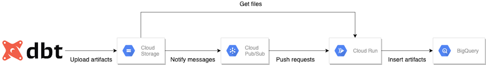

# dbt-artifacts-loader
It enables us to persist dbt artifacts uploaded on GCS to BigQuery with Cloud Run.



## How to use
1. We push a docker image to Google Container Registry
2. We apply the terraform resources to launch the Cloud Run application.
3. We upload dbt artifacts JSON files to Google Cloud Storage.
4. We create the dbt models to efficiently analyze dbt artifacts.

### Requirements
- docker
- terraform
- dbt-bigquery

### Push a docker image to Google Container Registry
Cloud Run accepts only a docker image on Google Cloud as Google Container Registry and Artifacts Registry.

```bash
export project="YOUR-PROJECT-ID"
docker build --rm -f Dockerfile  -t "gcr.io/${YOUR-PROJECT-ID}/dbt-artifacts-loader:latest" .
docker push "gcr.io/${YOUR-PROJECT-ID}/dbt-artifacts-loader:latest"
```

### Apply the terraform resources to launch the Cloud Run application.
[The terraform/example directory](./terraform/example) enables us to create required GCP resources and launch the Cloud Run application.
It creates:
- a GCS bucket to store dbt artifacts JSON files,
- a BigQuery dataset and tables to store dbt artifacts,
- a Pus/Sub topic and a corresponding Pub/Sub subscription to notify file uploads to Cloud Run, and
- a Cloud Run application to load uploaded dbt artifacts to BigQuery.

The terraform project asks us to specify a GCP project ID to allocate the resources and a location of GCS, BigQuery and Cloud Run.
`terraform apply` shows the prompt to enter the two.
If you want to fix them, please edit the default values in [`variables.tf`](./terraform/example/variables.tf).

```bash
cd terraform/example
terraform init
terraform apply
```

### Upload dbt artifacts JSON files to Google Cloud Storage.
We have set up the Cloud Run application to load dbt artifacts JSON files to BigQuery.
Now, let's upload a `run_results.json` to GCS manually.

```bash
gsutil cp "target/run_results.json" "gs://${project}-dbt-artifacts/"
```
The function which the repository doesn't contain is to upload dbt artifacts JSON file.
I would recommend you automate uploading JSON files to GCS after executing dbt.

### Create the dbt models to efficiently analyze dbt artifacts.
We have almost done.
The last thing we have to do is to create BigQuery tables with dbt, so that we efficiently analyze dbt artifacts.

To do that, we have to edit:
- [the `vars` in dbt_project.yml](./dbt_artifacts_models/dbt_project.yml) and
- [the project ID to run dbt in profiles.yml](./dbt_artifacts_models/profiles/profiles.yml).

```bash
cd dbt_artifacts_models
# Set up the environment for dbt
make setup
# Create and test the dbt models
make run && make test
```

## Known Issue
The application can deal with only `run_results.json` and `sources.json` at the moment.
We will support `catalog.json` and `manifest.json` in the next version.
