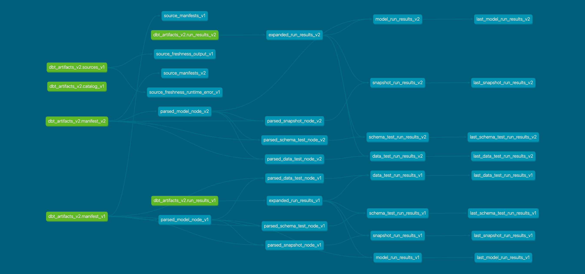

# dbt models for dbt artifacts
The dbt models enables us to deal with the dbt artifacts tables more easily.
Because the loaded tables have nested schema, it is annoying to expand them every time.

## How to use
We specify the project ID and dataset of the dbt artifacts tables in the `vars` block of `dbt_project.yml`.
The dataset ID can be different from that of the source tables.

```yaml
# dbt_project.yml
vars:
  dbt_artifacts_loader:
    project: "YOUR-PROJECT-ID"
    dataset: "dbt_artifacts"
```

## DAG

